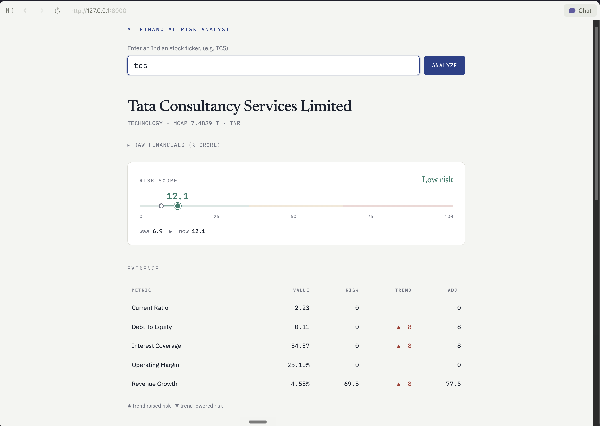
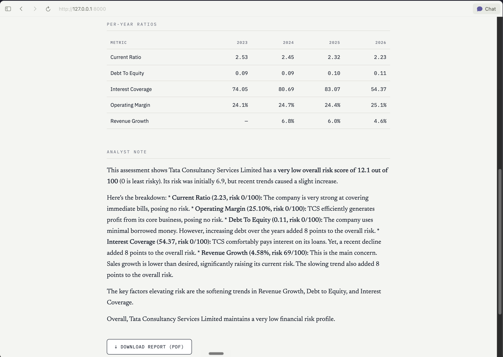
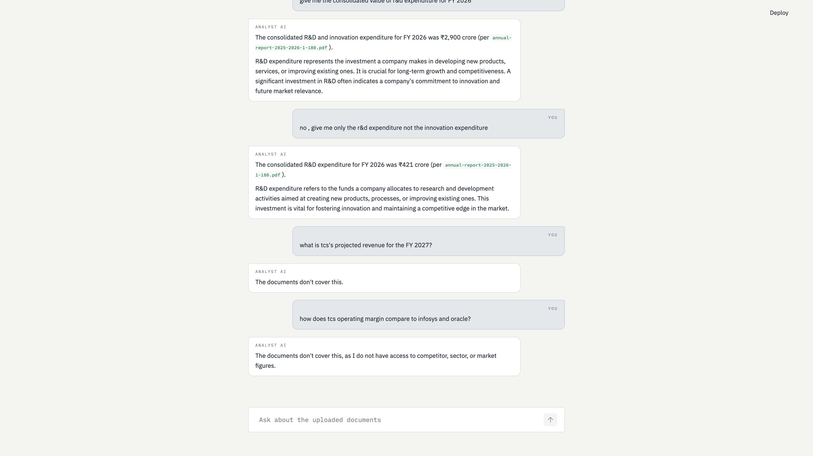
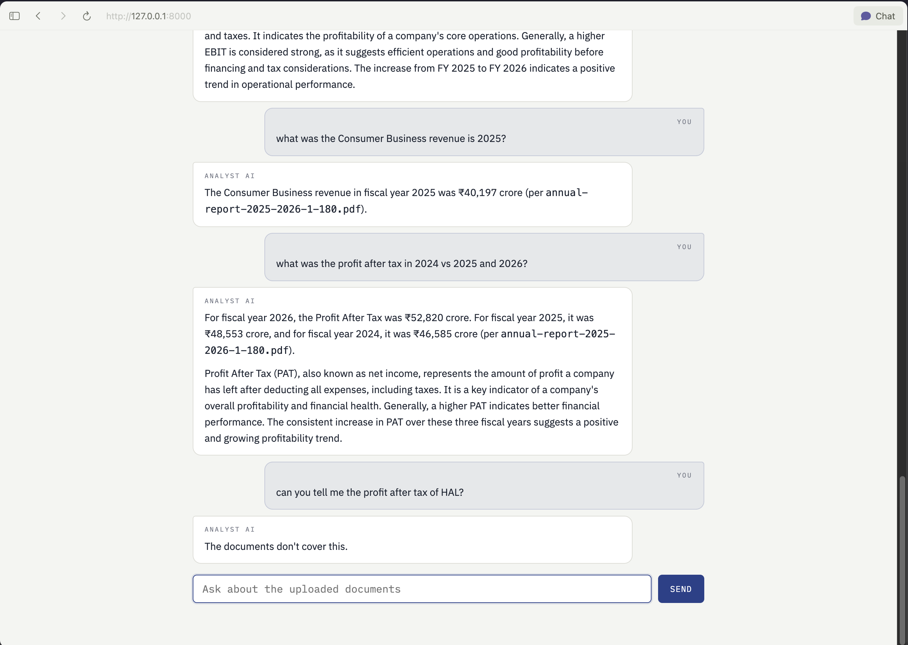

# AI Financial Risk & Due-Diligence Analyst

Enter an Indian stock ticker → fetch its financials → compute a transparent, code-driven risk
score → have an LLM explain it in plain English → export a PDF report. Upload an annual report
and ask grounded questions about it.

Most "AI stock analysis" tools let a language model **decide** how risky a company is, then hand
you a number with no way to check its work. This one flips that: the risk score is computed by
transparent, auditable code you can trace to a formula, and the AI is used only to **explain** it
in plain English. The principle behind every design decision is **never silently wrong** — show a
confident number only when the data backs it, and loudly flag when it doesn't.



---

## What it does

- **Risk score (0–100)** for an Indian listed company, computed from 5 financial ratios.
- **Multi-year trend adjustment** — the score nudges up/down based on whether each ratio is
  improving or deteriorating over the years yfinance provides.
- **Plain-English analyst note** — an LLM explains **the computed numbers**; it never computes,
  invents, or disputes them.
- **PDF report** — a downloadable one-page tearsheet of the score, evidence, and the note.
- **Document Q&A** — upload one or more finance PDFs and chat with them. Answers are strictly
  grounded in the uploaded documents, with every figure attributed to its source file.

## The one idea that matters: the LLM does **not** compute the score

The risk score is plain Python arithmetic over financial ratios (`risk.py`). The LLM's only job
is to **explain** the already-computed numbers in plain English (`summary.py`). This separation is
deliberate:

- The score is **deterministic, auditable, and reproducible** — same inputs always give the same
  number, and every sub-score traces back to a formula and a threshold.
- The LLM can't hallucinate a risk figure, because it's never asked to produce one.

This is the difference between "an AI guessed a risk score" and "a transparent model computed a
risk score, and an AI explained it." Only the second one is defensible in a due-diligence context.

## How the score works

Five ratios, each normalized to a 0–100 sub-score (0 = safe, 100 = risky), then weighted:

| Ratio | What it measures | Weight |
|---|---|---|
| Current Ratio | short-term liquidity | 20% |
| Debt-to-Equity | leverage | 25% |
| Interest Coverage | ability to service debt | 30% |
| Operating Margin | core profitability | 15% |
| Revenue Growth | top-line momentum | 10% |

A **trend adjustment** then shifts each sub-score by a bounded amount based on whether the ratio is
improving or deteriorating across the available years. The adjustment is deliberately
**asymmetric**: a deteriorating trend always surfaces as an early warning — even a company whose
numbers look strong today gets nudged up if its metrics are sliding — while an improving trend only
lowers risk where there's still risk to remove, so it can never manufacture a falsely reassuring
score for a company that's already deep in the safe zone.

### Honesty features (the "never silently wrong" part)

- **Banks / NBFCs / insurers are detected, not mis-scored.** Three of the five ratios come back
  unavailable for financial companies; when ≥2 are missing the app shows a low-confidence warning
  instead of a falsely precise number. **Detecting inapplicability is a feature.**
- **Sign inversions are guarded.** Negative equity (insolvent) and debt-free both clamp to the
  correct risk extreme instead of flipping.
- **A failed LLM call never breaks the report.** The summary degrades gracefully — you still get
  the score, evidence, and a downloadable PDF.
- **Single-source discipline.** Data is yfinance only (v1). The Document Q&A refuses to invent
  competitor/sector figures or merge numbers across documents — it answers only from what's
  uploaded, or says "the documents don't cover this."

### The analyst note

An LLM turns the computed numbers into a plain-English explanation — naming the metrics that drive
the score and whether each pushes risk up or down. It explains; it never recomputes.



## Document Q&A

Upload one or more finance PDFs and chat with them. Every figure is pulled **only from the uploaded
documents** and **attributed to its source file** — here, real figures read straight out of an
annual report, each with a brief plain-English read on what the metric means.



And when a fact simply isn't in the documents, it says so instead of guessing. Below, it answers
questions grounded in the uploaded (TCS) report, then **refuses** a question about HAL — a company
the documents don't cover — rather than inventing a number:



## Architecture

A plain HTML/CSS/JS front end talks to a small FastAPI back end, which wraps the Python pipeline:

```
Browser (static/)                     FastAPI (main.py)                  Pipeline
──────────────────                    ─────────────────                  ────────
index.html  ──┐                       GET  /api/analyze  ─────────────▶  data → risk → summary
styles.css    ├─ fetch(JSON) ──────▶  GET  /api/report   ─────────────▶  report.py (PDF)
app.js      ──┘                       POST /api/upload   ─────────────▶  docchat.extract_pdfs
                                      POST /api/chat     ─────────────▶  docchat.answer_question
```

The browser only renders; all the maths and formatting happen in Python, so the UI can't silently
drift from the computed numbers.

## Tech stack

- **Frontend:** plain HTML / CSS / JavaScript — a custom "research tearsheet" UI (`static/`), no
  framework. The page calls the backend over `fetch` and renders the JSON it gets back.
- **Backend:** FastAPI — serves the page and exposes the pipeline as JSON endpoints (`main.py`).
- **Data:** yfinance.
- **LLM:** Google Gemini via the `google-genai` SDK, behind a small swappable wrapper (`llm.py`) —
  no LangChain, to keep the logic explicit.
- **PDF in:** PyMuPDF (document extraction). **PDF out:** WeasyPrint (report generation).

## Project structure

```
data.py            fetch & clean financials from yfinance → (DataFrame, metadata)
risk.py            the code-computed risk engine: ratios → sub-scores → weighted score + trend
llm.py             swappable Gemini wrapper: get_llm_response(prompt) -> str | None
summary.py         builds a guardrailed prompt from the computed numbers, returns the analyst note
report.py          renders the PDF report (WeasyPrint)
docchat.py         Document Q&A: extract PDFs, budget-check, build a grounded prompt, answer
main.py            FastAPI backend: serves the frontend + exposes the pipeline as JSON endpoints
static/index.html  the page skeleton (HTML)
static/styles.css  the tearsheet design system (CSS)
static/app.js      frontend behavior: calls the API and paints the results into the page
```

## Setup

### 1. Install Python dependencies

```bash
python3 -m venv .venv
source .venv/bin/activate      # Windows: .venv\Scripts\activate
pip install -r requirements.txt
```

### 2. Install the native libraries WeasyPrint needs

`pip` **cannot** install these — they're system libraries. Without them, PDF export fails with a
`libgobject-2.0-0` error.

- **macOS:** `brew install pango`
- **Debian/Ubuntu:** `sudo apt-get install libpango-1.0-0 libpangocairo-1.0-0 libgdk-pixbuf2.0-0 libffi-dev`

> On macOS, `report.py` sets a `DYLD_FALLBACK_LIBRARY_PATH` shim at import time so WeasyPrint can
> find the Homebrew libs.

### 3. Add your Gemini API key

```bash
cp .env.example .env
# then edit .env and paste your key from https://aistudio.google.com/apikey
```

### 4. Run

```bash
uvicorn main:app --reload
```

Then open **http://127.0.0.1:8000** in your browser. Enter a ticker like `TCS`, `RELIANCE`, or
`INFY` (the `.NS` suffix is added automatically; pass `.BO` explicitly for BSE).

## Limitations (v1)

- **Single data source.** yfinance only — values are as good as yfinance's data; no cross-source
  reconciliation yet.
- **Indian equities only.** US/global is a planned extension (the ticker logic has a clean seam
  for it).
- **The risk model targets non-financial companies.** Banks/NBFCs/insurers are flagged as
  low-confidence rather than scored.
- **Document Q&A is long-context, not RAG**, and does **no OCR** — scanned/image-only PDFs are
  named and skipped rather than silently misread.
- **Document size is capped to the free Gemini tier** (≈250k input tokens/min, 20 requests/day).
  Very large filings are refused with a clear "too large" message rather than truncated — use a
  section or a smaller document. Table **values** are extracted; complex table **structure** is
  best-effort.

## Security

The Gemini API key lives only in `.env` (gitignored) and is loaded via `python-dotenv`. It is
never printed or committed. `.env.example` is the safe template to copy.
